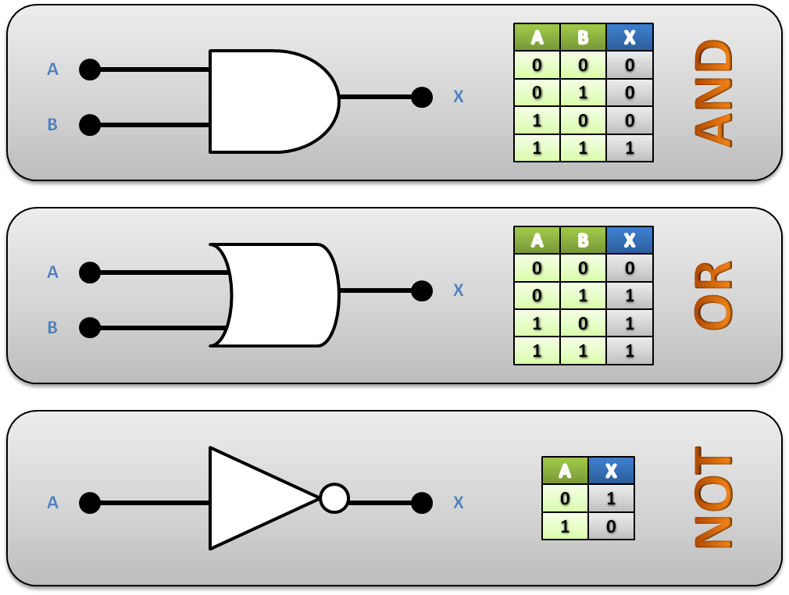

# Introducción

Esta funcionalidad nos permite hacer operaciones pero con numeros binarios, por ejemplo teniendo una variable a con numeros binarios, una variable b, y vamos a realizar operaciones, utilizando Operadores logicos, para que me devuelva un valor x.<br />

| A   | B   | X   |
| --- | --- | --- |
| 101 | 100 | ?   |
| 001 | 111 | ?   |

# Operadores Logicos

Utilizamos operadores lógicos para realizar comparaciones entre 2 valores, se usa para combinar 2 valores y obtener como resultado el valor: 1 (verdadero) o 0 (falso).<br />

Los 3 operadores principales son AND, OR & NOT. Para los siguientes ejemplos vamos a utilizar A y B como variables de entrada y X como variable de salida

## AND

Cuando A y B son 1, X es 1, en cualquier otro caso X es 0

## OR

Cuando A o B son 1, X es 1, en el unico caso que X puede ser 0 es cuando A y B son 0

## NOT

A diferencia de los otros operadores logicos, NOT solo recibe un valor de entrada, el valor de X sera el opuesto de A.<br />

Si A es 1, X sera 0, y si A es 0, X sera 1<br />

<br />

Existen otros operadores logicos que vamos a explicar a continuacion:

## XOR

Es igual que OR pero con la diferencia que si A y B son 1, X sera 0. El resultado de X es 1 cuando A y B no tienen ambos el mismo valor.<br />

Por ejemplo, si A y B son 1, X sera 0, y si A y B son 0, X sera 0 tambien, en cualquier otro caso X sera 1

## NAND

Es el opuesto de AND (AND + NOT), X tendra 0 cuando A y B tengan 1, en cualquier otro caso X tendra 1

## NOR

Es el opuesto de OR (OR + NOT), si A y B son 0, X sera 1, en cualquier otro caso X sera 0

## XNOR

Es el opuesto de XOR (XOR + NOT), el resultado de X es 1 cuando A y B tienen ambos el mismo valor.<br />

<br />

# Operadores Binarios en Go

Para los siguientes ejemplos vamos a utilizar una variable a de enteros positivos de 16 bits, le vamos a asignar un valor decimal y vamos a ver en pantalla el valor en formato decimal y en formato binario (utilizamos %b para ver su representacion en numeros binarios)

```go
var a uint16 = 213

fmt.Printf("Number %d in binary is %b\n", a, a)
```

### Left shift & Right shift

Usamos estos operadores para correr **n** cantidad de veces los numeros binarios, para la derecha (right shift) o para la izquiera (left shift).<br />

Left shift es representado por ‘<<’, por ejemplo:

```go
// numero_binario << cantidad_de_veces_a_mover = resultado

fmt.Printf("Number %d in binary is %b\n", a << 1, a << 1)
// 11010101 << 1  = 110101010 (lo movemos solo 1 vez)

fmt.Printf("Number %d in binary is %b\n", a << 10, a << 10)
// 11010101 << 10 = 101010000000000 (lo movemos 10 veces)
```

Right shift es representado por ‘>>’, por ejemplo:

```go

// numero_binario > cantidad_de_veces_a_mover = resultado

fmt.Printf("Number %d in binary is %b\n", a >> 1, a >> 1)
// 11010101 >> 1  = 1101010 (lo movemos 1 vez, el numero se va decrementando)

fmt.Printf("Number %d in binary is %b\n", a >> 10, a >> 10)
// 11010101 >> 10  = 0 (lo movemos 10 veces)

fmt.Printf("Number %d in binary is %b\n", a >> 5, a >> 5)
// 11010101 >> 10  = 110 (lo movemos 5 veces)
```

Va a llegar un punto que no lo vamos a poder decrementar mas y va a ser siempre cero, por ejemplo cuando lo quisimos mover 10 veces.

### Operadores logicos

Vamos a declarar otra variable para realizar los ejemplos:
(le agrego un formato de 10 a los numeros binarios al mostralo para que me rellene hasta 10 con ceros)

```go
var b uint16 = 20

fmt.Printf("'a': %.3d - %.10b\n", a, a) // a = 0011010101
fmt.Printf("'b': %.3d - %.10b\n\n", b, b) // b = 0000010100
```

Representacion de los operadores en Go:

- Si queremos hacer un AND de A y B hacemos: a & b
- Si queremos hacer un OR de A y B hacemos: a | b
- Si queremos hacer un XOR de A y B hacemos: a ^ b
- Si queremos hacer un NOT de A hacemos: ^ a<br />

(el ^ lo usamos tanto para XOR como para NOT)

```go
// AND
fmt.Printf("Bitwise AND: %d - %.10b\n", a & b, a & b)
// 0011010101 AND 0000010100 = 0000010100

// OR
fmt.Printf("Bitwise OR: %d - %.10b\n", a | b, a | b)
// 0011010101 OR 0000010100 = 0011010101

// XOR
fmt.Printf("Bitwise XOR: %d - %.10b\n", a ^ b, a ^ b)
// 0011010101 OR 0000010100 = 0011000001

fmt.Printf("Bitwise NOT: %d - %.10b\n", ^a, ^a)
// NOT 0011010101 = 1111111100101010
```

En el caso del NOT se ve un numero binario mas grande que los anteriores, esto es porque para los casos anteriores teniamos ceros a la izquierado que no representan nada, pero al hacer un NOT convierte esos ceros en uno que ya representan valores.<br />

Va a rellenar con uno hasta la capacidad que tenga la variable, en este caso son 16 bits.<br />

Para utilizar los operadores NAND, NOR y XNOR, hacemos lo mismo que en el ejemplo anterior pero agregregando un NOT a cada uno.<br />

Por ejemplo, si queremos hacer un NAND lo que hacemos es hacer un NOT de un AND.

```go
// NAND
fmt.Printf("Bitwise NAND: %d - %.10b\n", ^(a & b), ^(a & b))
// NOT (0011010101 AND 0000010100) = 1111111111101011
// 0011010101 NAND 0000010100      = 1111111111101011

// NOR
fmt.Printf("Bitwise NOR: %d - %.10b\n", ^(a | b), ^(a | b))
// NOT (0011010101 OR 0000010100) = 1111111100101010
// 0011010101 NOR 0000010100      = 1111111100101010

// XNOR
fmt.Printf("Bitwise XNOR: %d - %.10b\n", ^(a ^ b), ^(a ^ b))
// NOT (0011010101 XOR 0000010100) = 1111111100111110
// 0011010101 XNOR 0000010100      = 1111111100111110

```

# Ejemplo

Vamos a realizar un pequeño ejemplo utilizando roles, vamos a tener los roles READ, WRITE, UPDATE y DELETE, los cuales cada uno van a estar repesentados por numeros binarios solo teniendo un 1 en diferentes posiciones:

| Role   | Valor |
| ------ | ----- |
| READ   | 0001  |
| WRITE  | 0010  |
| UPDATE | 0100  |
| DELETE | 1000  |

Vamos a hacerlo de esta manera para poder sumarlos y en base a un numero (la sumatoria de los roles que queramos asignar a un perfil) poder identificar que roles tiene asignado el perfil.<br />

Entonces vamos a definir esas 4 variables que van a representar a los roles:

```go
READ_ROLE := 1         // 0001
WRITE_ROLE := 1 << 1   // 0010
UPDATE_ROLE := 1 << 2  // 0100
DELETE_ROLE := 1 << 3  // 1000
```

Luego vamos a asignarle roles a un perfil, vamos a agregarle los roles para escribir, leer y borrar:

```go
myProfile := READ_ROLE + WRITE_ROLE + DELETE_ROLE
// Perfil: 1011
```

Y ahora para validar si el perfil tiene permisos para realizar la operacion vamos a hacer un AND:

- Si el AND me devuelve el ROLE, entonces tiene permisos
- Si el AND me devuelve cero, entonces NO tiene permisos

| Role   | Valor role | Perfil | Resuldato AND |
| ------ | ---------- | ------ | ------------- |
| READ   | 0001       | 1011   | 0001          |
| WRITE  | 0010       | 1011   | 0010          |
| UPDATE | 0100       | 1011   | 0             |
| DELETE | 1000       | 1011   | 1000          |

```go

// valido por el role de actualizacion, no tiene permisos
fmt.Println("Does the user have permissions to perform the operation?")
if (0 != (myProfile & UPDATE_ROLE)) {
	fmt.Println("Yes! :D")
}else{
	fmt.Println("No :(")
}
```

```go
// valido por el role de lectura, tiene permisos
fmt.Println("Does the user have permissions to perform the operation?")
if (0 != (myProfile & READ_ROLE)) {
	fmt.Println("Yes! :D")
}else{
	fmt.Println("No :(")
}
```

# Conclusion

En este artículo, hemos explorado los fundamentos de los operadores binarios en Go y hemos aprendido cómo utilizarlos de manera efectiva en nuestras aplicaciones. Hemos visto cómo estos operadores nos permiten realizar operaciones lógicas y aritméticas a nivel de bits, lo que resulta útil en escenarios específicos. Recuerda que comprender y aplicar correctamente los operadores binarios puede mejorar el rendimiento y la eficiencia de tus programas. ¡Anímate a experimentar con ellos y a explorar más a fondo el poder de los operadores binarios en tus proyectos de Go!
